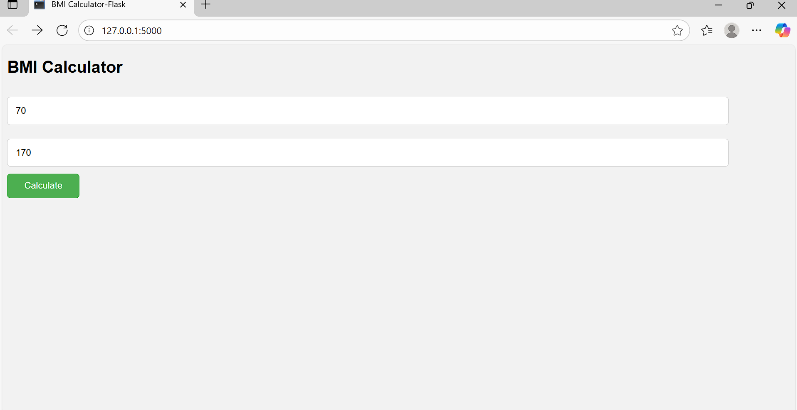
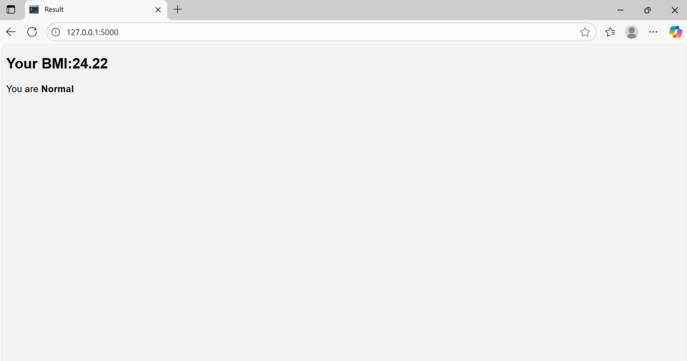

# BMI calculator (Flask)

A simple Flask web app to calculate your Body Mass Index (BMI) and determine your health category (Underweight, Normal, Overweight,Obese).

## Tech Stack
-Python 3
-Flask
-Html+CSS

## Screenshot

### Home Page

### Reault Page

## How to Run

'''bash
git clone https://github.com/Mohamed-Irshad-A/BMI-Calculator-Flask.git
cd bmi-calculator-flask
pip install -r requirements.txt
python app.py
